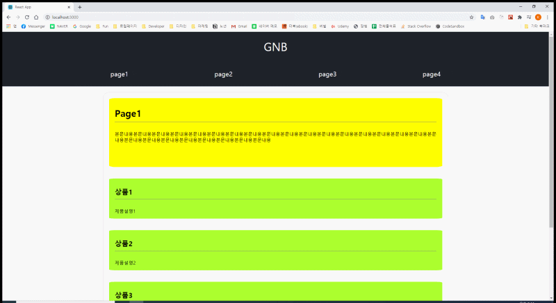

## 미션2 GNB 만들기

1. 상단 주메뉴는 화면 중앙 정렬 되어야 합니다.
2. 주메뉴 마우스 오버시 하단에 바가 표시되며 바 색상과 메뉴글자 색상은 일치합니다.
3. 주메뉴를 마우스 오버 하면 하단에 서브메뉴가 각각 노출됩니다.
4. 주메뉴를 클릭하면 하단 바가 고정됩니다.
5. 주메뉴 클릭시 주 메뉴에 해당하는 컨텐츠가 하단에 노출됩니다.
6. 주메뉴 1~4번까지 누를시 컨텐츠 내용은 바뀌어야 합니다.
7. 서브메뉴 클릭시 주메뉴 내용과 다른 서브 메뉴내용은 나오지 않고, 클릭한 서브메뉴 내용만 등장합니다.

.
